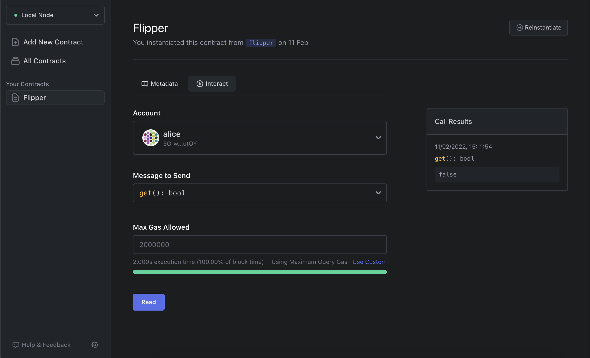

Now that your contract has been fully deployed, we can start to interact with it! Flipper only has two functions, so we will show you what it's like to play with both of them. Click the **"Execute Contract"** button on the confirmation screen that appeared after you deployed the instance of the Flipper contract in the previous step.

## get()

If you take a look back at our contract's `default()` function, we set the initial value of the Flipper contract to `false`. Let's check that this is the case.

In the **Message to Send** section, select the **"get(): bool"** message and accept the default values for the other options.

Press **"Call"** and confirm that it returns the value `false`:



> NOTE: You might be wondering: "Why did we need to specify gas when reading a value from a contract?"
>
> If you notice right above the "Call" button is a select box that allows you to "Send call as RPC call" or "Send as transaction". For a read-only request like this, we can simply use an RPC call which will _simulate_ a transaction, but not actually store anything on-chain. Thus, you will still need to specify the right amount of gas to cover your "virtual fee", but don't worry, nothing will be charged when making a call this way. :)

## flip()

So let's make the value turn `true` now!

The alternative _message to send_ we can make with the UI is `flip()`. Again, accept the default values for the other options.

You will notice that the `flip()` message defaults to a transaction call.


If the transaction was successful, we should then be able to go back to the `get()` function and see our updated storage:


Woohoo! You deployed your first smart contract!

## Moving Forward

We will not go over these setup and deployment steps again, but we will use them throughout the tutorial. You can always come back to this chapter if you need to remember how to do a certain process.

The rest of the tutorial will have **template code** which you will use to walk through the different steps of contract development. Each template comes with a fully designed suite of tests that should pass if you programmed your contract correctly. Before you move on from a section, make sure that you run:

```bash
cargo +nightly test
```

and that the tests all execute successfully, without any warnings.

You need not deploy your contract between each section, but if we ask you to deploy your contract, you will need to follow the same steps you have done with the Flipper contract.


